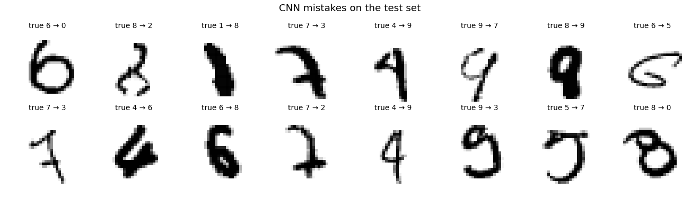

# Handwritten Digit Recognition (MNIST)

Classifying 28×28 handwritten digits: a dense neural network baseline, plus a small convolutional network.

## Results (10,000-image MNIST test set)

| Model | Test accuracy | Test loss | Parameters |
|---|---|---|---|
| Dense network (3 × 128 ReLU), 5 epochs | 97.50% | 0.086 | 134,794 |
| **Small CNN** (2 conv blocks + dropout), 5 epochs | **98.75%** | 0.041 | 34,826 |

The CNN is more accurate with about a quarter of the parameters. Its weakest digit is 9 (97.4% correct), and its most common mistake
is reading a 7 as a 2 (11 test images).



## Bug fixed from the first version

The original notebook contained `x_test = tf.keras.utils.normalize(x_train, axis=1)`. That line put normalised *training* images into
the test variable, so the reported test result (loss 64.7) wasn't a real test score. The previous README also listed pandas and sklearn,
but the project is TensorFlow/Keras. This version:
- scales train and test pixels identically to [0, 1];
- holds out 10% of the training data for validation;
- evaluates once on the untouched test set.

The original notebook is kept in `archive/`.

## Run it

```bash
pip install -r requirements.txt
jupyter nbconvert --to notebook --execute digit_classifier.ipynb   # ~1 min on CPU
```

The notebook downloads MNIST through `tf.keras.datasets`. If that download is blocked, it falls back to a local copy named
`mnist_local.npz` (same 70,000 images, not committed). The committed outputs were produced that way.

Tools: TensorFlow / Keras, NumPy, matplotlib.
